# Doc Pipeline — Git to `support_docs` Sync

## Summary

Markdown in `docs/support/` is the canonical source of truth. The `support_docs` Supabase table is a build-time cache populated by a GitHub Action on every push to main. Git diff audit trail; PR-reviewable; lawyer-friendly; AI-agent-friendly. The DB is a cache — never the source.

## Details

```mermaid
flowchart LR
  subgraph Dev["Developer machine"]
    EDIT[Author edits .md]
    HOOK[Pre-commit hook<br/>stamps frontmatter<br/>last_updated / change_ref]
    CHECK[npm run docs:sync-check<br/>validates frontmatter]
    EDIT --> HOOK --> CHECK
  end

  subgraph Repo["GitHub repo"]
    PR[Pull Request]
    CI[CI docs-audit + sync-check]
    MERGE[Merge to main]
    CHECK --> PR
    PR --> CI
    CI --> MERGE
  end

  subgraph GHA["GitHub Action"]
    TRIG[sync-support-docs.yml<br/>triggers on push to main<br/>paths: docs/support/**]
    WALK[Walk docs/support/<br/>build payload]
    POST[POST to ingest edge fn<br/>bearer INGEST_SUPPORT_DOCS_SECRET]
    MERGE --> TRIG --> WALK --> POST
  end

  subgraph Edge["Supabase edge fn"]
    INGEST[ingest-support-docs<br/>verify_jwt=false<br/>custom bearer auth]
    PARSE[gray-matter parse<br/>extract sections]
    VALIDATE[validate frontmatter<br/>active+legal rule]
    POST --> INGEST
    INGEST --> PARSE
    PARSE --> VALIDATE
  end

  subgraph DBCache["Supabase Postgres"]
    UPSERT[Upsert by slug]
    DELETE[Delete rows whose<br/>source_path no longer present]
    TRIG2[search_tsv trigger<br/>re-indexes on write]
    TBL[(support_docs)]
    VALIDATE --> UPSERT --> TBL
    VALIDATE --> DELETE --> TBL
    TBL --> TRIG2 --> TBL
  end

  subgraph Runtime["Runtime read path"]
    AG[RAVIO agent]
    Q[query_support_docs tool]
    AG --> Q
    Q --> TBL
  end
```

### Principles

1. **Git is source of truth.** The `.md` file, not the DB row, is canonical.
2. **One-way sync.** No admin UI writes directly to `support_docs`. Authoring is always git-mediated.
3. **Git diff = audit trail.** Every policy change has a commit SHA, an author, a reviewer (PR approval), and a timestamp.
4. **Lawyer-friendly.** Legal review happens on PR diffs, not on edits buried in an admin UI. Sign-off updates the `reviewed_by` + `reviewed_date` frontmatter fields via PR.
5. **Fast runtime.** GIN-indexed `search_tsv` + weighted columns give sub-10ms retrieval for typical queries.

### What triggers a sync

- Push to `main` where any file under `docs/support/**` changed (add / modify / delete)
- Manual `workflow_dispatch` for re-sync (e.g., after a DB restore)

### Failure modes

- **Ingest function down** → Action fails, CI notifies; retry via `workflow_dispatch` once healthy
- **Malformed frontmatter** → ingest returns errors for the bad file; other valid files still upsert; failing file is skipped with a warning in the Action output
- **DB unavailable** → Action fails; no partial writes (each batch is atomic per file)
- **Secret misconfigured** → Action fails with explicit error; no silent partial sync

### PROD cutover (held per CLAUDE.md)

Currently ingest points at DEV (oukbxqnlxnkainnligfz). PROD cutover checklist:

1. Deploy migration 060 to PROD
2. Deploy `ingest-support-docs` edge function to PROD
3. Set `INGEST_SUPPORT_DOCS_SECRET` on PROD Supabase
4. Update GH secret `SUPABASE_FN_URL` → `https://xzfllqndrlmhclqfybew.functions.supabase.co`
5. Relink Supabase CLI to DEV

### Schema compliance on write

The ingest function re-runs the same frontmatter validation as `scripts/docs-sync-check.ts`. Frontmatter changes that would fail CI also fail ingestion — belt and suspenders.

### Embedding expansion (future)

Current retrieval is keyword-only (tsvector). If we add pgvector, we can:

1. Add `embedding vector(1536)` column via ALTER TABLE (no rewrite needed)
2. Update ingest to compute + store embeddings per doc
3. Extend `query_support_docs` to re-rank with cosine similarity after keyword pre-filter

Deferred until we have evidence the keyword approach is insufficient.

## Related

- [`system-architecture.md`](./system-architecture.md)
- [`sequence-support-query.md`](./sequence-support-query.md) — how the agent reads this table
- [`README.md`](../README.md) — frontmatter schema + body structure
- [`GAP-ANALYSIS.md`](../GAP-ANALYSIS.md) — what's in the 20 docs
- Code: `supabase/functions/ingest-support-docs/index.ts`
- Code: `.github/workflows/sync-support-docs.yml`
- Code: `supabase/migrations/060_support_docs.sql`
- Code: `scripts/docs-sync-check.ts` (`checkSupportDocs`)
