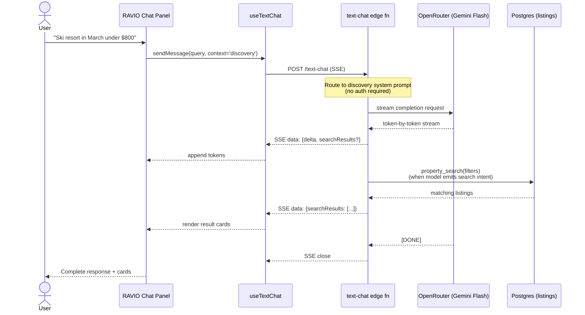
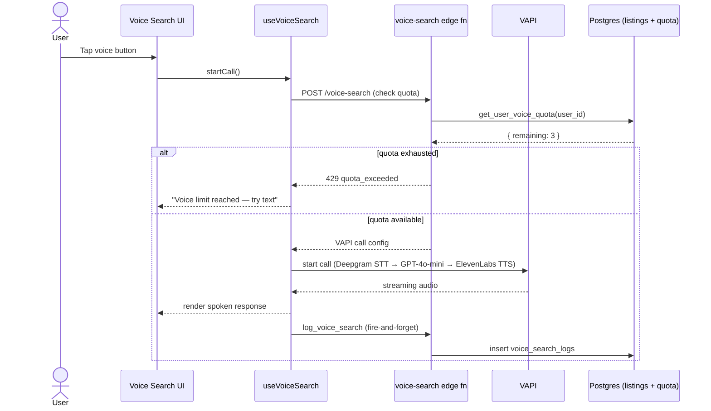

# Sequence — Discovery Query

## Summary

How a user's discovery query ("find me a ski resort in March under $800") flows through the system. Both text and voice paths are shown; the voice path is quota-gated and discovery-only per DEC-036.

## Details

### Text (RAVIO) discovery path

### Voice (VAPI) discovery path

### Notes

- **Same UI shell** — discovery is the default RAVIO context on `/rentals`, `/property/*`, `/tools/*`, `/destinations/*`, and ambiguous routes. No auth required.
- **Voice is separate** — different hook, different edge function, different LLM stack. Quota-gated per tier (Free 5/day → Premium unlimited).
- **Property search embedding** — when the discovery model needs to filter listings, it emits a tool-like payload that the edge function resolves against `listings` + `property_search` RPC. Results are streamed back inline with the response.
- **No account context** — discovery doesn't know about the user's specific bookings or disputes. That's the support path.

## Related

- [`system-architecture.md`](./system-architecture.md) — component overview
- [`sequence-support-query.md`](./sequence-support-query.md) — support path
- [`general-platform-faq.md`](../faqs/general-platform-faq.md) — voice quotas per tier
- Code: `supabase/functions/text-chat/index.ts`
- Code: `supabase/functions/voice-search/index.ts`
- Code: `src/hooks/useTextChat.ts`, `src/hooks/useVoiceSearch.ts`
