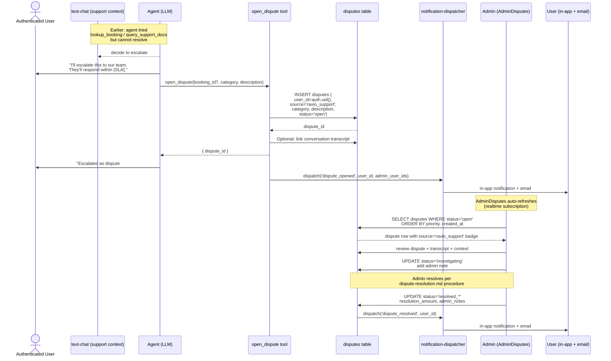

# Sequence — Agent Escalation to AdminDisputes

## Summary

When RAVIO cannot resolve a user's support question within its policy and tool boundaries, it opens a dispute record tagged `source: 'ravio_support'` that surfaces in the existing `AdminDisputes` dashboard. No parallel admin queue; no new notification channel. Humans pick it up from there.

## Details

### What the agent sends

The `open_dispute` tool call payload must include:

- `booking_id` (nullable — not all escalations are booking-linked)
- `category` — matches existing dispute category enum
- `description` — structured summary:
  - User's plain-English problem
  - What the agent tried (tool calls + results, redacted for sensitive fields)
  - Why the agent couldn't resolve
  - User's preferred contact channel
  - Timeline urgency if expressed
- `source: 'ravio_support'` — set by the tool, not the agent

### What the admin sees

- Standard dispute row in `AdminDisputes`, plus:
  - `source: 'ravio_support'` badge (visual distinction)
  - Link to the conversation transcript (via D1's `conversations.channel='ravio_support'` rows)
  - Agent's description pre-filled as the initial dispute text

### SLA handoff

- Agent quotes the tier-appropriate SLA from [`support-sla.md`](../processes/support-sla.md) to the user
- Admin tooling surfaces the SLA deadline
- D2 metrics tab reports compliance

### When NOT to escalate

- Question answerable from `support_docs` (even if the answer is "I don't know the specifics; here's the policy")
- General advice
- Feature requests (file via `Report Issue → Other` instead)
- Emergency / safety — use [`emergency-safety-escalation.md`](../processes/emergency-safety-escalation.md) flow instead (distinct SLA + routing)

### Admin → agent feedback loop

Post-resolution, the admin can tag the dispute with metadata (e.g., "agent escalated correctly" vs "agent could have answered"). This signal feeds D2 metrics and future system-prompt tuning.

## Related

- [`system-architecture.md`](./system-architecture.md)
- [`sequence-support-query.md`](./sequence-support-query.md) — the flow that led here
- [`customer-support-escalation.md`](../processes/customer-support-escalation.md) — escalation rules
- [`dispute-resolution.md`](../processes/dispute-resolution.md) — admin procedure
- Tracking: C5 #409 (source tagging), D1 #410 (conversation logging)
