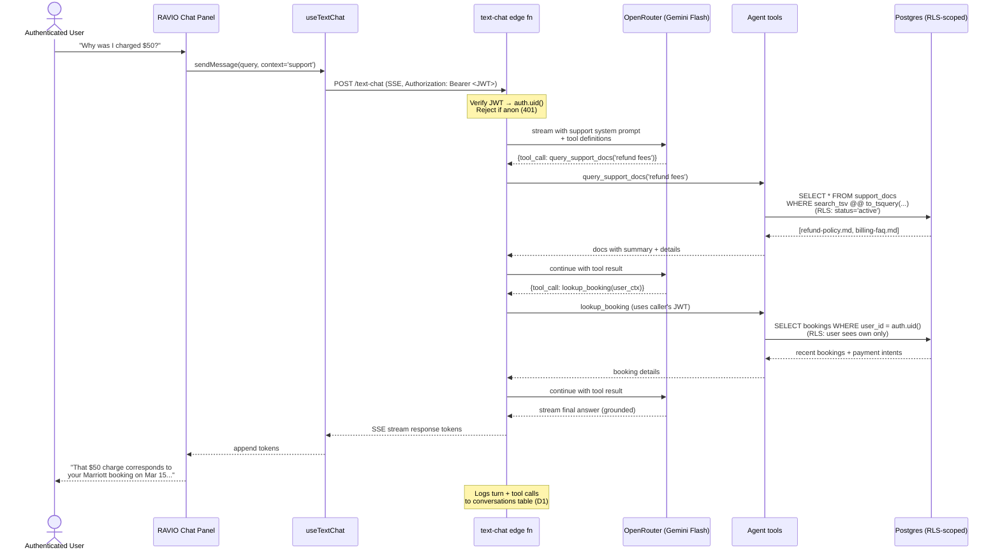

# Sequence — Support Query with Tool Use

## Summary

How RAVIO handles an authenticated support question ("why was I charged $50?"). Requires user auth; uses tool calls to fetch account-scoped data and retrieve relevant policy; streams a grounded response. No human involvement unless the agent escalates.

## Details

### Auth + RLS flow

1. User must be authenticated — anonymous hits on `context='support'` are rejected 401.
2. The edge function extracts `auth.uid()` from the Bearer JWT.
3. Every tool call either:
   - Uses the caller's JWT (user-scoped tools: `lookup_booking`, `check_refund_status`, `check_dispute_status`, `open_dispute`) — RLS enforces visibility
   - Uses the service_role but filters by `auth.uid()` explicitly (only for tools that need RLS-adjacent queries)
4. `query_support_docs` is a special case — reads active docs regardless of user. RLS policy `support_docs_read_active` allows any authenticated user.

### What the agent is allowed to do

- ✅ Answer from retrieved docs with cite
- ✅ Fetch the user's own bookings, refund status, dispute status
- ✅ Open a dispute on behalf of the user (tagged `source: 'ravio_support'`)
- ❌ Access another user's data
- ❌ Issue refunds directly (admin-only via `process-cancellation` / `process-dispute-refund`)
- ❌ Modify account settings, listings, or roles
- ❌ Bypass rate limits or quotas

If the agent cannot resolve, it escalates — see [`sequence-escalation.md`](./sequence-escalation.md).

### Logging

Every support turn is logged to `conversations` (D1) with:

- User message
- Agent response
- Tool calls + results (redacted for sensitive fields)
- Elapsed time
- Escalation flag (if applicable)

This powers the D2 admin metrics tab.

## Related

- [`system-architecture.md`](./system-architecture.md)
- [`sequence-discovery-query.md`](./sequence-discovery-query.md) — compared path
- [`sequence-escalation.md`](./sequence-escalation.md) — when agent can't resolve
- [`customer-support-escalation.md`](../processes/customer-support-escalation.md) — escalation rules
- Tracking issues: C1 #405, C2 #406, C3 #407, C4 #408
