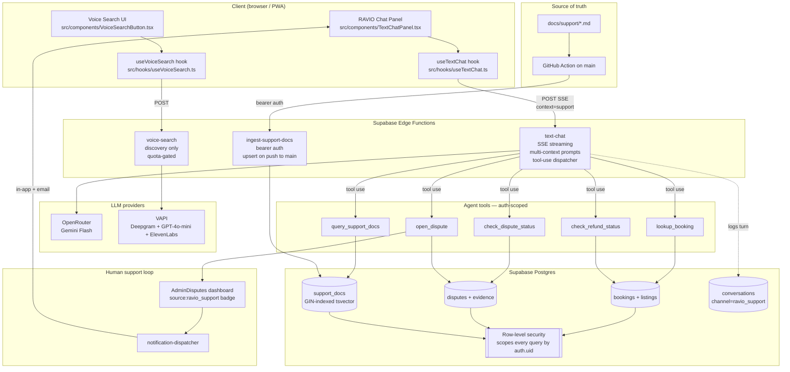

# System Architecture — RAVIO Support

## Summary

Full-stack view of how a user's support question flows from their browser to the Supabase backend, through the RAVIO text-chat edge function, through tool calls and document retrieval, and back as a streamed response. Voice search remains a parallel discovery-only path and is included for completeness.

## Details

### Component notes

- **RAVIO Chat Panel + useTextChat** — single UI surface with context-aware prompts. Route-based detection flips `context` from `discovery` to `support` automatically on `/my-trips`, `/my-bookings`, `/account`, `/owner-dashboard`, `/settings/*`. User-visible chip appears if the classifier overrode the route-based guess.
- **text-chat edge function** — already in production for discovery. C1 extends it with a `'support'` branch that requires authenticated user, uses a support-grounded system prompt, and declares tool-use schema. SSE streaming preserved.
- **voice-search edge function** — untouched by Phase 22. Remains quota-gated (Free 5/day → Premium unlimited). Never answers support queries.
- **Agent tools** — implemented in C4. Every tool enforces RLS via the caller's JWT. Tool errors return structured JSON the agent can reason about.
- **support_docs table** — migration 060. Populated by `ingest-support-docs` edge function on every push to main. GIN-indexed `search_tsv` for fast keyword retrieval. Weighted: title/tags A, summary B, details C, examples/body D.
- **conversations table** — D1 extension. Stores every support turn + tool call + result for audit and admin handoff.
- **AdminDisputes** — existing dashboard. C5 adds a `source` badge to distinguish agent-opened disputes. No parallel admin surface.

### Trust boundaries

1. **User ↔ Client** — standard browser boundary
2. **Client ↔ Edge fn** — Supabase JWT required for support context (C1 enforces)
3. **Edge fn ↔ Tools** — service_role can call anything; user-scoped tools use caller's JWT
4. **Edge fn ↔ support_docs** — read-only, user-scoped (RLS filters active docs)
5. **Ingest ↔ support_docs** — service_role write (RLS policy `support_docs_service_role_write`)
6. **GitHub ↔ Ingest** — custom bearer secret (`INGEST_SUPPORT_DOCS_SECRET`), not Supabase JWT

## Related

- [`sequence-discovery-query.md`](./sequence-discovery-query.md) — discovery message flow
- [`sequence-support-query.md`](./sequence-support-query.md) — support message flow
- [`sequence-escalation.md`](./sequence-escalation.md) — escalation path
- [`doc-pipeline.md`](./doc-pipeline.md) — markdown → DB sync
- [`CS-OVERVIEW.md`](../CS-OVERVIEW.md) — VC-ready one-pager
